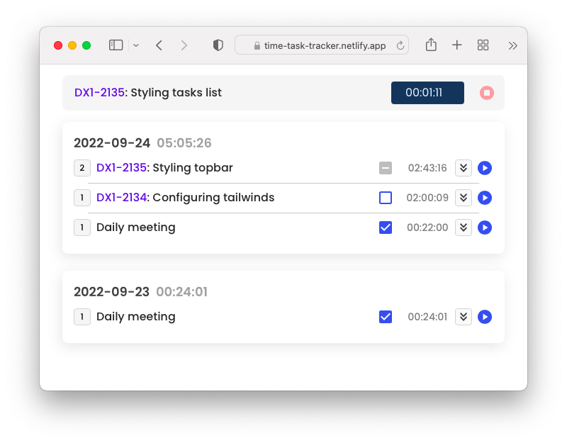

<h1 align="center">time task tracker</h1>

<div align="center">
	<a href="https://github.com/karlosos/time-task-tracker#what-is-it-%EF%B8%8F">About</a>
  <span> • </span>
    	<a href="https://github.com/karlosos/time-task-tracker#application-">Application</a>
  <span> • </span>
       	<a href="https://github.com/karlosos/time-task-tracker#contribute-">Contribute</a>
  <span> • </span>
        <a href="https://github.com/karlosos/time-task-tracker#features-">Features</a>
  <p></p>
</div>

<div align="center">
 
[](https://time-task-tracker.netlify.app/)
<!-- []() -->
<!-- <a href="https://github.com/NvChad/NvChad/blob/main/LICENSE"
        > -->
[](#)
[](#)
[]()
[]()
[]()
  </div>

## What is it? 📽️

- _time task tracker_ is webapp for tracking time without server synchronization
- all the data is stored in the local storage - no problems with synchronization
- automatically makes transforms jira ids to urls
- each time entry has checkbox for flagging the task already logged in jira

## Application 🔗

You can check the app [here](https://time-task-tracker.netlify.app/).

## Contribute 🧑‍💻

**My env**:

- node version 16.14.0 (working on 18.X too)
- npm version 8.3.1

**Developing the app**:

- clone app and run `npm install`
- start the app with `npm start`
- on macos I had to fix husky permissions (pre push checks)

```
chmod ug+x .husky/*
chmod ug+x .git/hooks/*
```

- test with `npm test`
- format code with prettier with `npm run format`
- lint code with `npm run lint`

## Features ✨

- tracking time
- editing existing time entry (changing text, start time and stop time)
- removing entries
- marking entries as logged in jira
